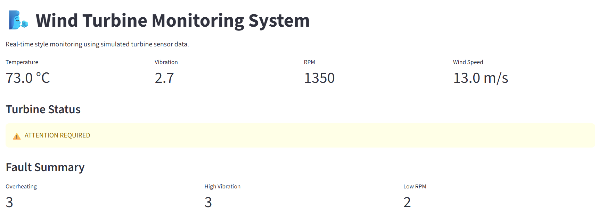

# 🌬️ Wind Turbine Monitoring & Fault Detection System

A Python-based monitoring system that analyzes simulated wind turbine sensor data, detects abnormal operating conditions, generates fault reports, and provides an interactive Streamlit dashboard.

## 🎯 Project Objective

The goal of this project is to monitor important turbine parameters and identify potential faults using predefined engineering thresholds.

## 📊 Parameters Monitored

- Temperature
- Vibration
- RPM
- Wind Speed

## 🚨 Faults Detected

| Parameter | Condition | Fault |
|-----------|-----------|-------|
| Temperature | > 90°C | Overheating |
| Vibration | > 6 | High Vibration |
| RPM | < 700 | Low RPM |

## 🛠️ Technologies Used

- Python
- Pandas
- Matplotlib
- Streamlit
- Pytest
- Object-Oriented Programming
- CSV Data Processing

## 🏗️ Project Structure

```text
wind_turbine_monitoring/
│
├── data/
│   └── turbine_data.csv
│
├── reports/
│   ├── temperature.png
│   ├── vibration.png
│   ├── rpm.png
│   ├── wind_speed.png
│   └── fault_report.csv
│
├── src/
│   ├── detector.py
│   ├── main.py
│   ├── models.py
│   ├── report.py
│   └── visualize.py
│
├── tests/
│   └── test_detector.py
│
├── dashboard.py
├── pytest.ini
└── README.md

## Dashboard


